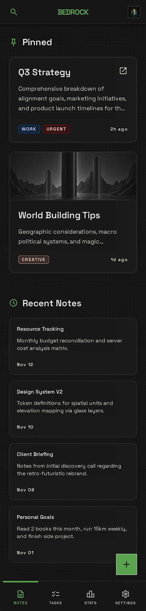
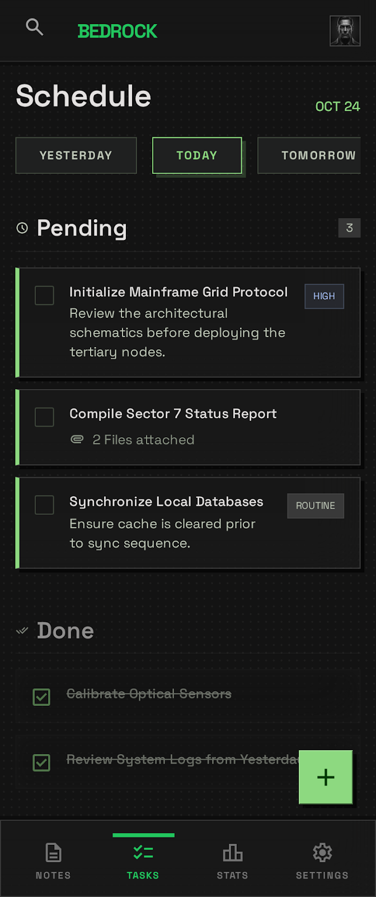
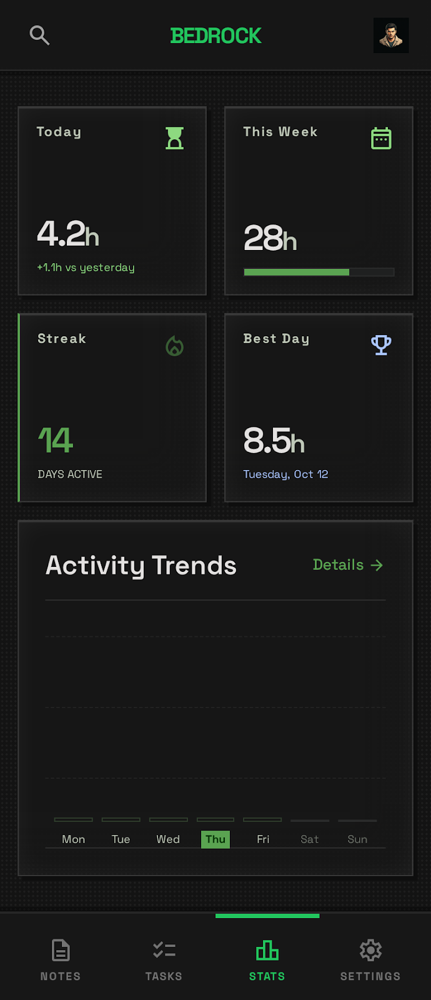
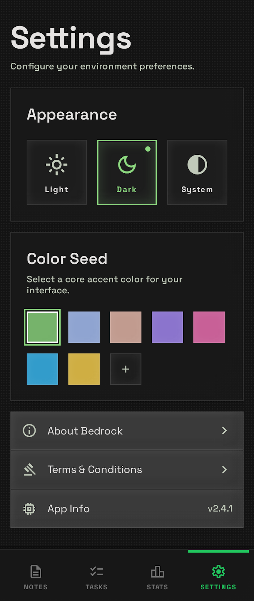

# 🪨 Bedrock 2.0

A minimalist productivity workspace built with Flutter.

Bedrock 2.0 combines note-taking, task management, progress tracking, and personal organization into a clean, distraction-free experience inspired by developer tools, terminal aesthetics, and modern glassmorphism design.

---

## ✨ Features

### 📝 Smart Notes

* Create and manage personal notes
* Pin important notes
* Organize content with categories
* Quick access to recent notes
* Clean and focused writing experience

### ✅ Task Management

* Create and track tasks
* Set due dates
* Monitor completion status
* Simple and intuitive workflow
* Designed for daily productivity

### 📊 Productivity Statistics

* Activity tracking
* Productivity insights
* Task completion analytics
* Visual progress overview
* Personal performance monitoring

### ⚙️ Customizable Experience

* Modern glassmorphism-inspired UI
* Dark theme optimized
* Personalized onboarding
* User profile setup
* Responsive design

### 🚀 Cross Platform

Built with Flutter and supports:

* Android
* Windows
* Linux
* Web

---

## 📸 Screenshots

### Welcome Screen


### Notes



### Tasks



### Statistics



### Settings



---

## 🏗️ Project Structure

```text
lib/
├── core/
│   ├── constants/
│   └── theme/
│
├── data/
│   ├── database/
│   └── models/
│
├── providers/
│
├── screens/
│   ├── onboarding/
│   ├── notes/
│   ├── tasks/
│   ├── stats/
│   ├── settings/
│   └── splash/
│
└── widgets/
```

---

## 🛠️ Tech Stack

* Flutter
* Dart
* Provider State Management
* SQLite/Local Storage
* Material Design 3
* Glassmorphism UI Components

---

## 🚀 Getting Started

### Prerequisites

* Flutter SDK
* Dart SDK
* Android Studio / VS Code

### Installation

Clone the repository:

```bash
git clone https://github.com/hirak8918/Bedrock-2.0.git
```

Navigate to the project:

```bash
cd Bedrock-2.0
```

Install dependencies:

```bash
flutter pub get
```

Run the application:

```bash
flutter run
```

---

## 🎯 Vision

Bedrock aims to be more than just another productivity application.

The goal is to create a digital workspace that feels calm, intentional, and efficient—allowing users to capture ideas, manage tasks, and monitor progress without unnecessary complexity.

---

## 🔮 Future Roadmap

* Cloud synchronization
* AI-powered note organization
* Markdown support
* Rich text editor
* Calendar integration
* Data backup and restore
* Desktop-first productivity features
* Advanced analytics dashboard

---

## 🤝 Contributing

Contributions, feature suggestions, and feedback are welcome.

Feel free to open an issue or submit a pull request.

---

## 📄 License

This project is licensed under the MIT License.

See the LICENSE file for details.

---

## 👨‍💻 Author

**Hirak Barman**

Building tools that combine productivity, design, and technology.
